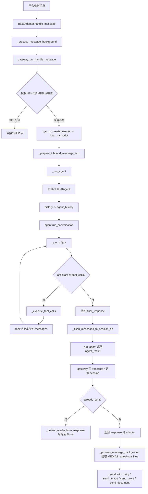

# Hermes 从接收消息到最终回复的关键路径

本文基于当前本机代码阅读整理，目标是说明 Hermes gateway 模式下，一条消息如何从平台入口一路流到 agent、工具调用、持久化与最终发送。

输出位置：`~/.hermes/docs/hermes-message-to-response-flow.md`

## 1. 总览

核心分成 5 层：

1. 平台适配层接收消息并放入后台处理
2. gateway `run.py` 的 `_handle_message()` 做授权、命令分流、会话准备、上下文准备
3. gateway `run.py` 的 `_run_agent()` 创建/复用 `AIAgent`，把 transcript 转成 agent history，并在线程池里调用 `agent.run_conversation()`
4. `run_agent.py` 内部执行 LLM/tool loop，生成 `final_response`，并把消息刷入 SQLite session DB
5. gateway / adapter 对最终文本做媒体提取与平台发送，并更新 transcript / session 状态

## 2. 主流程图



## 3. 入口：平台适配层

关键文件：
- `~/.hermes/hermes-agent/gateway/platforms/base.py`

### 3.1 后台处理入口

`BaseAdapter._process_message_background()`
参考：`gateway/platforms/base.py:1593`

职责：
- 为当前 session 建立 active 标记
- 启动 typing indicator
- 调用注入的 message handler（通常就是 gateway 的 `_handle_message`）
- 如果 handler 返回了文本，则在 adapter 层做最终发送前处理

关键发送逻辑：
- `extract_media(response)`：提取 `MEDIA:<path>`
- `extract_images(response)`：提取图片 URL
- `extract_local_files(text_content)`：自动识别裸本地路径
- `_send_with_retry(...)`：发送文本
- `send_image/send_animation/send_voice/send_video/send_document/send_image_file`：发送附件

也就是说，普通非流式回复的“最后一跳”是在 adapter 层完成的，不是在 `_handle_message()` 里直接发。

## 4. gateway 主入口：`_handle_message()`

关键文件：
- `~/.hermes/hermes-agent/gateway/run.py`

参考：`gateway/run.py:2374`

### 4.1 前置分流

`_handle_message()` 先做这些事：
- 内部事件绕过授权检查
- 无 user_id 消息直接忽略
- 未授权用户走配对逻辑
- 处理 update prompt 回复
- 如果当前 session 已有运行中的 agent：
  - `/status` 直接查状态
  - `/restart` 特判
  - `/stop` 强制中断并解锁 session
  - `/new`/`/reset` 中断后重置
  - `/queue` 入队
  - `/model` 拒绝在运行中切换
  - `/approve`/`/deny` 直接走审批处理
  - `/background` 直接旁路
  - photo follow-up 在运行中只排队不打断

这一步决定消息到底是：
- 命令直接处理
- 被排队
- 打断当前 agent
- 进入正常对话处理

### 4.2 会话与 transcript 准备

参考位置：
- `gateway/run.py:3104`
- `gateway/run.py:3240`
- `gateway/run.py:3537`
- `gateway/run.py:3556`

正常消息路径里会做：
- `session_store.get_or_create_session(source)`
- `session_store.load_transcript(session_entry.session_id)`
- session hygiene / 自动压缩检查
- 构造 `context_prompt`
- 调用 `_prepare_inbound_message_text(...)`
  - 会把图片等附件预处理成可供模型消费的文本上下文

之后进入：
- `_run_agent(message=..., context_prompt=..., history=..., session_id=..., session_key=...)`

## 5. `_run_agent()`：gateway 到 AIAgent 的桥

参考：
- `gateway/run.py:7395`
- agent 创建/缓存：`gateway/run.py:7862-7912`
- history 转换：`gateway/run.py:7948-8000`
- 真正执行：`gateway/run.py:8097`
- 结果收尾：`gateway/run.py:8135-8223`

### 5.1 创建或复用 AIAgent

`_run_agent()` 会：
- 根据当前 turn 解析 model/runtime route
- 计算 agent 配置签名
- 优先从 `_agent_cache` 复用 agent
- 如果缓存失效，则新建 `AIAgent(...)`

新建 agent 时会注入：
- model / provider / base_url / api_key 等 runtime
- `enabled_toolsets`
- `ephemeral_system_prompt`
- `prefill_messages`
- `session_id`
- `session_db`
- fallback model 等

### 5.2 transcript -> agent_history 转换

gateway 读取的 transcript 不是原样直接喂给 agent，而是先清洗：
- 跳过 `session_meta`
- 跳过 `system`
- 普通消息保留 `{role, content}`
- 含 `tool_calls` / `tool_call_id` / `role == tool` 的 rich messages 原样保留核心字段
- assistant 的 reasoning 字段也会尽量保留

原因很关键：
如果历史里已经有 assistant→tool→tool result 的链条，不能在恢复时把它简化掉，否则下游 API 会看到非法的消息序列。

### 5.3 线程池中执行 `agent.run_conversation()`

`_run_agent()` 内部定义 `run_sync()`，在线程里调用：
- `result = agent.run_conversation(message, conversation_history=agent_history, task_id=session_id)`

这一步是同步 agent loop 和异步 gateway 的边界。

同时 `_run_agent()` 还负责：
- 注册 dangerous command approval 的 gateway callback
- 绑定 progress/stream/status/interim 回调
- 跟踪 running agent 以支持 interrupt
- 处理 stream consumer

## 6. `run_conversation()`：agent 主循环入口

关键文件：
- `~/.hermes/hermes-agent/run_agent.py`

参考：`run_agent.py:7703`

`run_conversation()` 的主要职责：
- 初始化 turn 级状态和 retry 计数器
- 复制 `conversation_history` 到内部 `messages`
- 把本轮 user message 追加到 `messages`
- 构建或复用 system prompt
- 做 preflight compression
- 然后进入 LLM/tool 调用主循环

### 6.1 消息初始化

关键点：
- `messages = list(conversation_history) if conversation_history else []`
- `messages.append({"role": "user", "content": user_message})`

因此 agent 内部的 `messages` 是“历史 + 本轮 user + 后续 assistant/tool 消息”的完整工作集。

### 6.2 system prompt 与 session DB

如果是会话延续，agent 会优先从 SQLite session row 中取已存的 `system_prompt`，而不是重新构造。

这样做是为了：
- 避免系统 prompt 因 memory 变化而漂移
- 保持 Anthropic prefix cache 的稳定性

### 6.3 preflight compression

参考：`run_agent.py:7899-7955`

如果历史 + tools + system prompt 的粗略 token 估计已经过阈值：
- 会先执行 `_compress_context(...)`
- 压缩可能产生新的 `session_id`
- 之后再进入正式 LLM 循环

这意味着最终返回给 gateway 的 session_id 可能已经不是原来的那个。

## 7. LLM/tool 主循环

这一段虽然本次没有整块全文展开，但从多个关键函数可还原主链：
- `_execute_tool_calls()`：`run_agent.py:6862`
- `_invoke_tool()`：`run_agent.py:6885`
- `_execute_tool_calls_concurrent()`：`run_agent.py:6959`
- `_execute_tool_calls_sequential()`：`run_agent.py:7165`
- iteration-limit summary / final_response 汇总：`run_agent.py:7580-7701`

### 7.1 assistant 先产出一条消息

当模型返回 assistant message 后，分两种：

1. 有 `tool_calls`
   - 追加 assistant message 到 `messages`
   - 调 `_execute_tool_calls(...)`
   - tool result 作为 `{"role": "tool", ...}` 继续 append 到 `messages`
   - 再进入下一轮 API 调用

2. 没有 `tool_calls`
   - 这通常就是最终自然语言回复
   - 主循环结束，进入结果整理

### 7.2 tool 调用分发

`_invoke_tool()` 对几类工具做内建分发：
- `todo`
- `session_search`
- `memory`
- `clarify`
- `delegate_task`

其余工具走：
- `handle_function_call(...)`

也就是说，agent 级工具和 registry 工具在这里汇合。

### 7.3 并发 vs 顺序

`_execute_tool_calls()` 会先判断一批 tool call 是否可并行：
- 只读工具通常允许并发
- 文件读写只有路径不冲突时才可能并发
- 否则回退到 sequential

并发模式下：
- 用 thread pool 执行多个 `_invoke_tool`
- 结果按原 tool call 顺序 append 回 `messages`

这点很重要：
执行可以并发，但写回消息序列必须保持 tool_call 原始顺序，否则上游 API 历史会乱。

## 8. `final_response` 如何产生

主要有两类出口：

### 8.1 正常出口

当 assistant 最后一条消息没有 tool call 时，主循环会把那条内容视为最终回复。

### 8.2 迭代上限后的 summary 出口

参考：`run_agent.py:7580-7701`

如果达到 iteration limit 还没得到自然结束：
- agent 会构造一个不带 tools 的 summary 请求
- 再向模型请求一段收尾总结
- 成功后 append 一条 assistant summary 到 `messages`
- 作为 `final_response` 返回

## 9. agent 内部持久化：SQLite session DB

参考：
- `_persist_conversation(...)` -> `_flush_messages_to_session_db(...)`
- `run_agent.py:2290-2345`

`_flush_messages_to_session_db()` 会：
- `ensure_session(...)`
- 用 `_last_flushed_db_idx` 防止重复写入
- 把新增 messages 逐条 append 到 SQLite
- assistant 的 reasoning / reasoning_details / codex_reasoning_items 也会一起写
- tool_calls / tool_call_id / finish_reason 也会保留

这意味着：
agent 本身已经负责把完整消息流写入 SQLite，所以 gateway 之后写 transcript 时要避免再次写 DB，防止 duplicate-write bug。

## 10. `_run_agent()` 返回前的收尾

参考：`gateway/run.py:8135-8223`

### 10.1 从 tool result 里补 `MEDIA:` 标签

即使模型最终文本里没把 `MEDIA:path` 说出来，tool result（比如 TTS）里也可能包含它。

`_run_agent()` 会扫描本轮 tool messages：
- 收集新的 `MEDIA:path`
- 避免重复历史中的旧 path
- 如需要补上 `[[audio_as_voice]]`
- 然后把这些 tag 追加到 `final_response`

这样 adapter 层只需要统一处理最终 response 文本，就能发送本轮媒体文件。

### 10.2 session split 修正

如果 compression 期间 agent 产生了新的 `session_id`：
- gateway 会更新 `session_store` 当前 entry
- 并把 `history_offset` 置成 0

原因：
压缩后 messages 已经不是原历史的简单追加了；如果还沿用旧 history offset，会导致 gateway 在 transcript 层错过压缩后的完整消息集合。

### 10.3 `_run_agent()` 的返回结构

核心字段：
- `final_response`
- `messages`
- `api_calls`
- `tools`
- `history_offset`
- `last_prompt_tokens`
- `input_tokens`
- `output_tokens`
- `model`
- `session_id`
- `response_previewed`

## 11. `_handle_message()` 的后处理

参考：`gateway/run.py:3574-3795`

拿到 `agent_result` 后，gateway 会：
- 提取 `response = agent_result["final_response"]`
- 如果 agent failed 且没有 response，生成兜底错误文案
- 如有需要，把 reasoning prepend 到 response
- 触发 `agent:end` hook
- drain process watcher 事件

### 11.1 transcript 持久化

参考：`gateway/run.py:3686-3760`

这里会把本轮新增消息写入 transcript：
- fresh session 时先写 `session_meta`，包含 tools/model/platform
- 用 `history_offset` 只切出本轮新增的 `new_messages`
- 写 JSONL transcript
- 若 agent 已经写过 SQLite，则 transcript 这里 `skip_db=True`，避免重复

### 11.2 already_sent 特判

参考：`gateway/run.py:3775-3793`

如果 streaming 已经把文本发给用户了：
- `_handle_message()` 不再把文本返回给 adapter
- 但仍会调用 `_deliver_media_from_response(response, ...)` 发送媒体
- 最后返回 `None`

这就是“文本已流式发送，但 media 仍需后送”的补洞逻辑。

## 12. adapter 层最终发送

参考：`gateway/platforms/base.py:1629-1795`

如果 `_handle_message()` 返回了 response：
- adapter 先 `extract_media`
- 再 `extract_images`
- 再 `extract_local_files`
- 文本通过 `_send_with_retry(...)`
- 图片/音频/视频/文档走各自 native sender

因此最终用户看到的回复可能由多部分组成：
- 一条文本消息
- 一条或多条图片/语音/视频/文件

## 13. 关键数据对象的流向

### 13.1 `history`
来源：`session_store.load_transcript(session_id)`

用途：
- gateway 的上下文准备
- 转为 `agent_history` 喂给 AIAgent

### 13.2 `agent_history`
来源：gateway 对 transcript 的清洗结果

用途：
- `agent.run_conversation(..., conversation_history=agent_history)`

### 13.3 `messages`
来源：AIAgent 内部工作消息数组

内容：
- 历史消息
- 当前 user
- assistant/tool/tool_calls/reasoning/final assistant

用途：
- API 请求上下文
- session DB 持久化
- 返回给 gateway 做 transcript 切片

### 13.4 `final_response`
来源：
- 正常 assistant 最终输出
- 或 iteration-limit summary
- 之后可能被 gateway 追加 `MEDIA:` 标签

用途：
- 直接返回给 adapter
- 或在 already_sent 模式下仅用于媒体投递

## 14. 最值得注意的几个设计点

1. gateway transcript 与 agent SQLite 持久化是两套机制
   - SQLite 由 agent 主写
   - transcript 由 gateway 主写
   - gateway 通过 `skip_db` 防止重复写入

2. transcript 不能无脑简化 rich messages
   - tool_calls / tool_call_id / tool messages 恢复时必须保留

3. compression 会改变 session_id
   - `_run_agent()` 和 `_handle_message()` 都做了修正与同步

4. media 发送不是只看模型最终文本
   - gateway 会从 tool result 回收 `MEDIA:path`
   - adapter 再统一提取并发送

5. streaming 与非 streaming 的最后发送路径不同
   - 非流式：adapter 根据返回文本发送
   - 流式：文本已发送，`_handle_message()` 只补发媒体

## 15. 最短主路径（便于脑内记忆）

```text
平台消息
-> BaseAdapter._process_message_background
-> Gateway._handle_message
-> session_store.get_or_create_session/load_transcript
-> _prepare_inbound_message_text
-> Gateway._run_agent
-> AIAgent.run_conversation
-> assistant/tool 循环
-> final_response + messages + DB flush
-> Gateway 写 transcript / 修正 session / 补 media tags
-> Adapter 发送文本和附件
```

## 16. 本次确认过的关键代码位置

- 接收/发送后台流程：`gateway/platforms/base.py:1593-1819`
- gateway 主入口：`gateway/run.py:2374-2634`
- 会话准备与调用 agent：`gateway/run.py:3537-3564`
- agent 结果后处理与 transcript：`gateway/run.py:3574-3795`
- `_run_agent()` 内部 agent 创建/缓存/历史转换：`gateway/run.py:7830-8223`
- agent DB flush：`run_agent.py:2290-2345`
- tool dispatch：`run_agent.py:6862-7165`
- iteration-limit summary / final_response：`run_agent.py:7580-7701`
- `run_conversation()` 入口与预压缩：`run_agent.py:7703-7959`

## 17. 一句话结论

Hermes 的关键路径不是“收到消息 -> 调模型 -> 发文本”这么简单，而是：
“平台后台处理 -> gateway 会话/上下文编排 -> AIAgent tool loop -> agent 级 DB 持久化 -> gateway transcript 修正与媒体补齐 -> adapter 平台原生投递”的分层流水线。